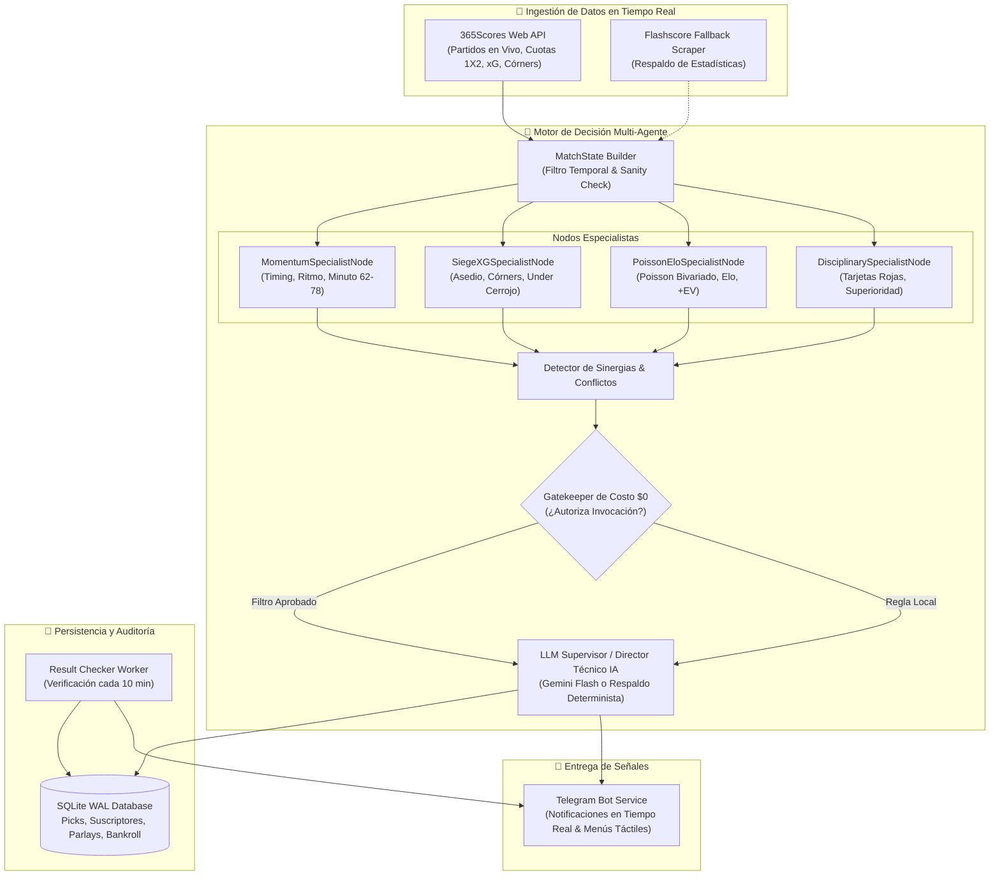

# ⚽🤖 BetBot AI - Autonomous Sports Analytics & Decision Engine

<div align="center">


**Motor autónomo de pronósticos deportivos en tiempo real para fútbol, combinando teoría de grafos multi-agente, modelos cuantitativos (Poisson bivariado, Elo, +EV), árboles de decisión heurísticos y un Bot de Telegram interactivo de alto rendimiento.**

[Características](#-características-principales) •
[Arquitectura](#-arquitectura-del-sistema) •
[Comandos de Telegram](#-comandos-de-telegram) •
[Modo Francotirador](#-modo-francotirador-sniper-mode) •
[Instalación](#-instalación-y-despliegue) •
[Aviso Legal](#-aviso-legal-y-juego-responsable)

</div>

---

## 🌟 Características Principales

* 🧠 **Grafo de Decisión Multi-Agente (Módulo 7)**: Red de nodos especialistas autónomos (*Momentum*, *Asedio & xG*, *Poisson/Elo Cuantitativo*, *Disciplinario*) que colaboran y resuelven conflictos tácticos en tiempo real.
* 🤖 **Director Técnico IA (Gemini Flash)**: Inferencia contextual asistida por IA con supervisor determinista de respaldo $100\%$ resiliente a fallos.
* 🎯 **Modo Francotirador (Sniper Mode)**: Filtro de alta efectividad con umbral mínimo de confianza $\ge 78\%$, descarte de partidos fuera de ventana ($\le 80'$) y purga automática de feeds congelados.
* 📈 **Value Betting Cuantitativo (+EV)**: Comparación matemática entre la probabilidad calculada por Poisson bivariado y las cuotas de mercado de las casas de apuestas.
* 🛡️ **Gatekeeper de Costo $0**: Filtro de costo computacional nulo que resuelve el $90\%$ de los análisis en milisegundos y solo invoca al LLM cuando existe valor comprobado.
* 📱 **Interfaz Táctil en Telegram**: Menús interactivos con botones Inline, consulta de partidos del día (`/jornada`), análisis táctico bajo demanda (`/analizar`) y generador de apuestas combinadas (`/combinada`).
* 📊 **Auditoría Financiera y Gestión de Bankroll**: Cálculo automático de Unidades Ganadas (+/- U), ROI / Yield %, racha actual y gestión de Stake con Criterio de Kelly fraccional.
* 🐳 **Operación 24/7 en la Nube**: Empaquetado en Docker con servidor HTTP de telemetría y salud (`/health`) listo para Render, Koyeb o VPS.

---

## 🏛️ Arquitectura del Sistema



---

## 🎯 Modo Francotirador (Sniper Mode)

Para maximizar el *Win-Rate* y proteger el bankroll, BetBot incorpora reglas estrictas de calidad antes que cantidad:

1. **Umbral Mínimo de Confianza $\ge 78\%$**: Solo se emiten apuestas donde el modelo matemático y los especialistas alcanzan alta certeza.
2. **Hard Minute Cutoff ($\le 80'$)**: Se prohíbe terminantemente enviar apuestas en vivo después del minuto 80' o en tiempo de descuento (90'+).
3. **Control de Tiempo Real Transcurrido ($\Delta t$ Sanity Check)**: 
   - Purga automática de partidos congelados en la API que superen los 125 minutos reales de juego.
   - Purga de partidos con supuesto entretiempo que lleven más de 75 minutos reales desde el pitazo inicial.
4. **Filtro de Ligas Principales**: Monitoreo enfocado en ligas Tier 1 y Tier 2 con máxima liquidez y transparencia arbitral.

---

## 📱 Comandos de Telegram

| Comando | Descripción |
| :--- | :--- |
| `/start` | Inicia el bot, registra al usuario y abre el menú táctil interactivo. |
| `/menu` | Despliega el panel de control táctil con botones Inline. |
| `/jornada` | Muestra el calendario de partidos monitoreados hoy y los activos en vivo. |
| `/analizar [equipo]` | Ejecuta un análisis táctico profundo bajo demanda con el Director Técnico IA. |
| `/combinada` | Genera un parlay inteligente de 2 a 3 selecciones con valor matemático (+EV). |
| `/bankroll` | Muestra la auditoría financiera en vivo: Unidades ganadas (+/- U), ROI / Yield y racha. |
| `/historial` | Consulta los últimos 10 pronósticos enviados con su resultado auditado. |
| `/stats` | Métricas históricas de efectividad global por mercado. |
| `/pause` / `/resume` | Pausa o reactiva temporalmente la recepción de alertas automáticas. |
| `/status` | Estado del motor en segundo plano y estadísticas de suscriptores. |

---

## 📂 Estructura del Proyecto

```
bet_bot/
├── src/
│   ├── analyzer/           # Árboles heurísticos, lógica combinada y parlays
│   ├── bot/                # Cliente de Telegram, manejadores táctiles y servidor de salud
│   ├── db/                 # Repositorios SQLite en modo WAL y esquemas relacionales
│   ├── graph/              # DecisionGraph, Nodos Especialistas, Gatekeeper y Supervisor IA
│   ├── models/             # Distribución Poisson, modelo Elo y cálculo de Valor (+EV)
│   ├── scraper/            # Clientes de 365Scores y Flashscore Fallback
│   └── worker/             # Tareas en segundo plano (verificación y escaneo periódico)
├── tests/                  # Suite integral de pruebas unitarias y de integración
├── Dockerfile              # Contenedor de producción optimizado para Python 3.12
├── ROADMAP.md              # Hoja de ruta interna y registro de desarrollo
├── requirements.txt        # Dependencias de producción
└── telegram_bot.py         # Punto de entrada principal
```

---

## 🚀 Instalación y Despliegue

### Requisitos Previos
* **Python 3.12+**
* Un token de bot de Telegram (obtenido a través de [@BotFather](https://t.me/BotFather))
* *(Opcional)* API Key de Google Gemini para explicaciones tácticas avanzadas con IA

### 1. Clonar el Repositorio
```bash
git clone https://github.com/Levelasquez15/bet_bot.git
cd bet_bot
```

### 2. Configurar el Entorno Virtual
```bash
python -m venv .venv
# En Windows:
.venv\Scripts\activate
# En Linux / macOS:
source .venv/bin/activate

pip install -r requirements.txt
```

### 3. Variables de Entorno
Crea un archivo `.env` en la raíz del proyecto (este archivo está protegido por `.gitignore` y **nunca** debe subirse a Git):
```ini
TELEGRAM_BOT_TOKEN=tu_token_de_telegram_aqui
GEMINI_API_KEY=tu_api_key_de_gemini_aqui
PORT=8000
```

### 4. Ejecutar Localmente
```bash
python telegram_bot.py
```

### 5. Despliegue con Docker
```bash
# Construir la imagen
docker build -t bet_bot:latest .

# Ejecutar el contenedor
docker run -d --name bet_bot_app --env-file .env -p 8000:8000 bet_bot:latest
```

---

## 🧪 Pruebas Unitarias

Para ejecutar la suite de pruebas completa:

```bash
# Validar suite general del bot
python tests/test_bot_suite.py

# Validar Grafo de Decisión y Nodos Especialistas
python tests/test_graph_module.py
```

---

## ⚖️ Aviso Legal y Juego Responsable

Este software ha sido desarrollado con fines exclusivamente educativos, estadísticos y de investigación cuantitativa. Ninguna de las señales, análisis o recomendaciones emitidas por el sistema constituye asesoramiento financiero formal. Las apuestas deportivas conllevan riesgo intrínseco de pérdida de capital. Apuesta siempre de manera responsable y únicamente dinero que estés dispuesto a perder (+18).
